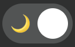

# ThemeToggler

 




An accessible theme toggler adapting dynamically to prefers-color-scheme media query, so to the user settings of dark mode enabled or not. It's a vanilla javascript web component, hence can be intalled on an Angular, React or Vue app.

Example here : https://polyhedra-viewer.netlify.app/

## Install

```bash
$ npm i @galpop/themetoggler
```

## Usage

```javascript
<theme-toggler></theme-toggler>
```

## Features

- focusable with the keyboard
- reacts dynamically to the user setting defining dark/light mode
